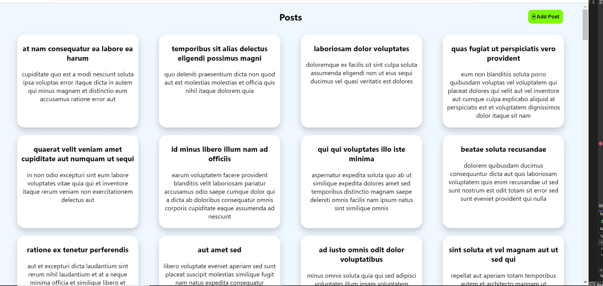

A simple and responsive React application for managing and displaying posts with post adding capability.

## Table of Contents

- [Introduction](#introduction)
- [Features](#features)
- [Installation](#installation)
- [Usage](#usage)
- [Project Structure](#project-structure)

## Introduction

This React application allows users to manage and display posts fetched from an API. It includes features such a responsive design, and a pop-up modal component. The app is built with React, Redux for state management.

## Features

- Fetch and display posts from an API
- Responsive design with CSS media queries
- Pop-up modal with click-outside-to-close functionality
- State management with Redux

## Screenshots



## Installation

Clone the repository
   ```bash
   git clone https://github.com/Cybovp/BlueOC.git

   cd Task3

   npm install

   npm start

The app will be available at http://localhost:3000.

```
## Project Structure

```bash
my-react-app/
├── public/             # Public assets
├── src/
│   ├── components/     # Reusable components (e.g., PostForm)
│   ├── slices/         # Redux slices and feature-specific logic
│   ├── App.js          # Main app component
│   ├── index.js        # Entry point of the application
│   └── store.js        # Redux store configuration
├── package.json        # Project dependencies and scripts
└── README.md           # Project documentation
```